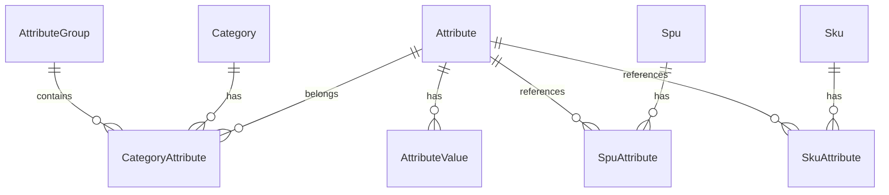

# 商品属性管理系统 PRD
## Product Attribute Bundle - 产品需求文档

**版本**: 1.0.0  
**日期**: 2025-01-06  
**作者**: Product Team  
**状态**: 待评审

---

## 1. 项目概述

### 1.1 背景
随着电商业务的快速发展，商品种类和数量急剧增加，仅依靠商品分类（类目）已无法满足商品管理、搜索筛选和精准推荐的需求。需要建立一套完善的商品属性管理系统，实现商品信息的结构化管理。

**核心问题**：
- 商品类目层级有限，无法精细化管理海量商品
- 商品关键特性分散在详情描述中，用户查找困难
- 多规格商品管理成本高，需要重复录入大量信息
- 商品信息非结构化，无法实现精准搜索和推荐

### 1.2 目标
- **用户价值**：帮助买家快速了解商品特性，通过属性筛选找到目标商品，缩短决策时间
- **商家价值**：提高商品信息填写效率，实现结构化管理，提升商品信息质量
- **平台价值**：实现商品信息结构化，支持精准搜索和个性化推荐，提升转化率

### 1.3 范围
本期实现商品属性的基础管理功能，包括：
- 属性定义与管理
- 属性值管理
- 属性与类目关联
- 属性分组
- SPU/SKU属性集成
- 属性搜索与筛选

### 1.4 不包含范围
- 属性的多语言支持（下期实现）
- 属性的版本管理（下期实现）
- 属性的审批流程（下期实现）

---

## 2. 核心概念定义

### 2.1 属性（Attribute）
**定义**：描述商品特性的维度，是商品信息结构化的基本单元。

**组成**：
- 属性名称：描述维度的名称，如"颜色"、"尺寸"
- 属性值：具体的描述内容，如"红色"、"XL"

**示例**：
```
属性：颜色
属性值：红色、蓝色、白色、黑色

属性：存储容量
属性值：64GB、128GB、256GB、512GB
```

### 2.2 属性分类

#### 2.2.1 销售属性（Sales Attribute）  
**定义**：用于区分不同SKU的关键属性，决定了商品的销售单元。

**特点**：
- 不同的销售属性值组合对应不同的SKU
- 每个SKU可以有独立的价格和库存
- 用户在商品详情页可以选择切换
- 注意：属性系统不直接生成SKU，而是为已存在的SKU提供属性描述

**示例**：
- 服装：颜色、尺码
- 手机：颜色、存储容量
- 鞋子：颜色、鞋码

#### 2.2.2 非销售属性（Non-sales Attribute）
**定义**：描述商品特性但不影响SKU区分的属性。

**特点**：
- 同一SPU下所有SKU共享相同值
- 主要用于商品信息展示
- 用于搜索和筛选

**示例**：
- 手机：屏幕尺寸、处理器型号、电池容量
- 服装：材质、适用季节、风格
- 图书：作者、出版社、ISBN

#### 2.2.3 自定义属性（Custom Attribute）
**定义**：商家根据自身需求添加的个性化属性。

**特点**：
- 灵活定义，不受系统预设限制
- 可用于特殊商品的描述
- 支持多种输入类型

**示例**：
- 定制商品：刻字内容、定制要求
- 服务商品：服务时长、服务范围
- 特殊标记：限量版编号、签名版本

### 2.3 属性值类型

| 类型 | 说明 | 示例 | 适用场景 |
|-----|------|------|---------|
| 枚举单选 | 从预定义值中选择一个 | 性别：男/女 | 固定选项的属性 |
| 枚举多选 | 从预定义值中选择多个 | 适用场景：商务/休闲/运动 | 多标签属性 |
| 文本输入 | 自由输入文本 | 产品型号：iPhone 14 Pro | 无法枚举的属性 |
| 数值输入 | 输入数字 | 重量：500（克） | 数值型属性 |
| 日期输入 | 选择日期 | 生产日期：2024-01-01 | 时间相关属性 |
| 布尔值 | 是/否选择 | 是否支持5G：是 | 二选一属性 |

### 2.4 属性与SPU/SKU的关系

```
SPU (Standard Product Unit) - 标准产品单位
├── 基本信息（名称、描述、品牌等）
├── 非销售属性（所有SKU共享）
│   ├── 品牌、材质、产地等
│   └── 屏幕尺寸、处理器等
└── SKU (Stock Keeping Unit) - 库存单位
    ├── SKU编码
    ├── 销售属性值组合（如：红色+L码）
    ├── 价格
    ├── 库存
    └── 其他销售信息

关系说明：
1. SPU包含多个SKU
2. 每个SKU通过销售属性值的组合来区分
3. 非销售属性在SPU层级定义，所有SKU共享
4. 属性系统为SKU提供属性描述，但不生成SKU
```

---

## 3. 功能需求

### 3.1 属性管理

#### 3.1.1 属性定义
**功能描述**：创建和管理商品属性的基本信息。

**字段设计**：
| 字段 | 类型 | 必填 | 说明 |
|-----|------|-----|------|
| 属性编码 | String | 是 | 唯一标识，如 "color", "size" |
| 属性名称 | String | 是 | 显示名称，如 "颜色", "尺寸" |
| 属性类型 | Enum | 是 | sales（销售）/non_sales（非销售）/custom（自定义） |
| 值类型 | Enum | 是 | single/multiple/text/number/date/boolean |
| 输入类型 | Enum | 是 | select/checkbox/input/textarea/datepicker |
| 单位 | String | 否 | 如 "克"、"毫米" |
| 是否必填 | Boolean | 是 | 默认false |
| 是否搜索 | Boolean | 是 | 是否参与搜索，默认false |
| 是否筛选 | Boolean | 是 | 是否作为筛选项，默认false |
| 排序权重 | Integer | 是 | 默认0，越大越靠前 |
| 状态 | Enum | 是 | active/inactive |
| 备注 | String | 否 | 内部使用说明 |

**业务规则**：
1. 属性编码全局唯一，创建后不可修改
2. 销售属性的值类型只能是单选（用于唯一确定SKU）
3. 已被商品使用的属性不能删除，只能禁用
4. 属性类型创建后不可修改

#### 3.1.2 属性值管理
**功能描述**：管理枚举类型属性的预定义值。

**字段设计**：
| 字段 | 类型 | 必填 | 说明 |
|-----|------|-----|------|
| 属性值编码 | String | 是 | 在属性内唯一 |
| 属性值名称 | String | 是 | 显示名称 |
| 属性值别名 | String[] | 否 | 用于搜索匹配 |
| 颜色值 | String | 否 | 颜色属性专用，HEX格式 |
| 图片URL | String | 否 | 属性值配图 |
| 排序权重 | Integer | 是 | 默认0 |
| 状态 | Enum | 是 | active/inactive |

**功能特性**：
- 支持批量导入（Excel/CSV）
- 支持批量导出
- 支持拖拽排序
- 支持属性值合并（处理重复值）

#### 3.1.3 属性验证规则
**功能描述**：为自定义输入类型的属性设置验证规则。

**验证类型**：
| 验证类型 | 适用输入类型 | 配置项 | 示例 |
|---------|------------|--------|------|
| 长度限制 | 文本 | min, max | 5-50个字符 |
| 数值范围 | 数字 | min, max | 0-9999 |
| 正则表达式 | 文本 | pattern | ^[A-Z0-9]+$ |
| 日期范围 | 日期 | startDate, endDate | 2024-01-01 至今 |
| 文件格式 | 文件 | extensions | jpg,png,pdf |
| 文件大小 | 文件 | maxSize | 最大5MB |

### 3.2 属性与类目关联

#### 3.2.1 关联机制
**功能描述**：建立属性与商品类目的关联关系。

**关联规则**：
1. **直接关联**：属性关联到特定类目
2. **继承机制**：子类目自动继承父类目的所有属性
3. **覆盖机制**：子类目可以覆盖父类目属性的配置（如是否必填）

**示例**：
```
服装（一级类目）
├── 颜色（通用属性）
├── 尺码（通用属性）
└── 男装（二级类目）
    ├── 继承：颜色、尺码
    ├── 新增：版型
    └── 衬衫（三级类目）
        ├── 继承：颜色、尺码、版型
        └── 新增：袖长、领型
```

#### 3.2.2 关联配置
**功能描述**：配置属性在特定类目下的表现。

**配置项**：
| 配置项 | 说明 | 示例 |
|--------|------|------|
| 是否必填 | 覆盖属性的默认必填设置 | 手机类目下"品牌"必填 |
| 是否显示 | 控制属性是否在该类目显示 | 图书类目不显示"尺寸" |
| 默认值 | 设置属性的默认值 | 默认颜色"黑色" |
| 值范围 | 限制可选值范围 | 童装尺码只显示90-160 |
| 排序 | 调整在该类目下的显示顺序 | - |
| 分组 | 指定属性所属分组 | 归类到"基本信息"组 |

### 3.3 属性分组

#### 3.3.1 分组管理
**功能描述**：将相关属性组织成组，优化展示结构。

**分组类型**：
| 分组名称 | 说明 | 包含属性示例 |
|---------|------|------------|
| 基本信息 | 商品基础属性 | 品牌、型号、产地 |
| 规格参数 | 商品规格相关 | 颜色、尺寸、容量 |
| 功能特性 | 功能相关属性 | 防水等级、续航时间 |
| 包装信息 | 包装相关属性 | 包装尺寸、毛重、配件 |
| 其他信息 | 未分组属性 | 自定义属性 |

**字段设计**：
| 字段 | 类型 | 必填 | 说明 |
|-----|------|-----|------|
| 分组编码 | String | 是 | 唯一标识 |
| 分组名称 | String | 是 | 显示名称 |
| 分组图标 | String | 否 | 图标class |
| 是否展开 | Boolean | 是 | 默认展开状态 |
| 排序权重 | Integer | 是 | 显示顺序 |

#### 3.3.2 分组应用
**功能特性**：
- 不同类目可以有不同的分组方案
- 支持拖拽调整属性在组内的顺序
- 前端按分组折叠/展开显示
- 支持分组模板，快速应用到类目

### 3.4 SPU/SKU集成

#### 3.4.1 SPU属性填写
**流程设计**：
1. 选择商品类目
2. 系统加载该类目的所有属性（含继承）
3. 按分组展示属性列表
4. 填写非销售属性值
5. 选择启用的销售属性
6. 为销售属性选择可用值

**交互设计**：
- 必填属性标红星提示
- 实时验证输入合法性
- 支持从历史商品复制属性
- 支持属性模板快速填充

#### 3.4.2 SKU属性关联
**功能描述**：为已存在的SKU关联销售属性值。

**关联方式**：
1. **手动关联**：为每个SKU手动选择对应的销售属性值组合
2. **批量关联**：通过Excel导入SKU与属性值的对应关系
3. **规则关联**：根据SKU编码规则自动匹配属性值

**示例**：
```
SKU: IPHONE14-RED-128G
销售属性关联：
- 颜色 = 红色
- 存储容量 = 128GB
```

**业务规则**：
- 每个SKU的销售属性值组合必须唯一
- 同一SPU下的SKU必须使用相同的销售属性
- SKU可以先创建，后关联属性

### 3.5 属性搜索与筛选

#### 3.5.1 搜索配置
**功能描述**：配置哪些属性参与商品搜索。

**配置项**：
| 配置项 | 说明 | 示例 |
|--------|------|------|
| 搜索权重 | 属性在搜索中的重要性 | 品牌权重10，材质权重3 |
| 分词规则 | 中文分词、拼音等 | "苹果"匹配"Apple" |
| 同义词 | 搜索同义词配置 | "笔记本"="laptop"="手提电脑" |
| 搜索建议 | 是否在搜索建议中显示 | 显示品牌建议 |

#### 3.5.2 筛选配置
**功能描述**：配置商品列表页的筛选项。

**筛选展示**：
- 单选类型：单选框
- 多选类型：复选框
- 数值类型：区间选择器
- 颜色类型：色块选择

**高级特性**：
- 显示每个筛选值的商品数量
- 支持多条件组合筛选
- 筛选项智能排序（按商品数/点击率）
- 无结果时的筛选项置灰

---

## 4. 数据模型设计

### 4.1 ER图


### 4.2 核心数据表

#### 4.2.1 属性表（attribute）
```sql
CREATE TABLE attribute (
    id BIGINT PRIMARY KEY,
    code VARCHAR(50) UNIQUE NOT NULL COMMENT '属性编码',
    name VARCHAR(100) NOT NULL COMMENT '属性名称',
    type ENUM('sales', 'non_sales', 'custom') NOT NULL COMMENT '属性类型',
    value_type VARCHAR(20) NOT NULL COMMENT '值类型',
    input_type VARCHAR(20) NOT NULL COMMENT '输入类型',
    unit VARCHAR(20) COMMENT '单位',
    is_required BOOLEAN DEFAULT FALSE COMMENT '是否必填',
    is_searchable BOOLEAN DEFAULT FALSE COMMENT '是否可搜索',
    is_filterable BOOLEAN DEFAULT FALSE COMMENT '是否可筛选',
    sort_order INT DEFAULT 0 COMMENT '排序权重',
    validation_rules JSON COMMENT '验证规则',
    status ENUM('active', 'inactive') DEFAULT 'active',
    created_at TIMESTAMP DEFAULT CURRENT_TIMESTAMP,
    updated_at TIMESTAMP DEFAULT CURRENT_TIMESTAMP ON UPDATE CURRENT_TIMESTAMP,
    created_by VARCHAR(50),
    updated_by VARCHAR(50),
    INDEX idx_code (code),
    INDEX idx_type_status (type, status)
);
```

#### 4.2.2 属性值表（attribute_value）
```sql
CREATE TABLE attribute_value (
    id BIGINT PRIMARY KEY,
    attribute_id BIGINT NOT NULL,
    code VARCHAR(50) NOT NULL COMMENT '属性值编码',
    value VARCHAR(200) NOT NULL COMMENT '属性值',
    aliases JSON COMMENT '别名列表',
    color_value VARCHAR(7) COMMENT '颜色值(HEX)',
    image_url VARCHAR(500) COMMENT '图片URL',
    sort_order INT DEFAULT 0,
    status ENUM('active', 'inactive') DEFAULT 'active',
    created_at TIMESTAMP DEFAULT CURRENT_TIMESTAMP,
    updated_at TIMESTAMP DEFAULT CURRENT_TIMESTAMP ON UPDATE CURRENT_TIMESTAMP,
    UNIQUE KEY uk_attr_code (attribute_id, code),
    FOREIGN KEY (attribute_id) REFERENCES attribute(id),
    INDEX idx_attribute_id (attribute_id)
);
```

#### 4.2.3 类目属性关联表（category_attribute）
```sql
CREATE TABLE category_attribute (
    id BIGINT PRIMARY KEY,
    category_id BIGINT NOT NULL COMMENT '类目ID',
    attribute_id BIGINT NOT NULL,
    group_id BIGINT COMMENT '分组ID',
    is_required BOOLEAN COMMENT '是否必填(覆盖默认)',
    is_visible BOOLEAN DEFAULT TRUE COMMENT '是否显示',
    default_value VARCHAR(500) COMMENT '默认值',
    allowed_values JSON COMMENT '允许的值范围',
    sort_order INT DEFAULT 0,
    config JSON COMMENT '其他配置',
    created_at TIMESTAMP DEFAULT CURRENT_TIMESTAMP,
    UNIQUE KEY uk_category_attribute (category_id, attribute_id),
    FOREIGN KEY (attribute_id) REFERENCES attribute(id),
    INDEX idx_category_id (category_id)
);
```

#### 4.2.4 SPU属性值表（spu_attribute）
```sql
CREATE TABLE spu_attribute (
    id BIGINT PRIMARY KEY,
    spu_id BIGINT NOT NULL,
    attribute_id BIGINT NOT NULL,
    value_ids JSON COMMENT '属性值ID列表(多选)',
    value_text TEXT COMMENT '文本值(自定义输入)',
    created_at TIMESTAMP DEFAULT CURRENT_TIMESTAMP,
    updated_at TIMESTAMP DEFAULT CURRENT_TIMESTAMP ON UPDATE CURRENT_TIMESTAMP,
    UNIQUE KEY uk_spu_attribute (spu_id, attribute_id),
    FOREIGN KEY (attribute_id) REFERENCES attribute(id),
    INDEX idx_spu_id (spu_id)
);
```

#### 4.2.5 SKU销售属性表（sku_attribute）
```sql
CREATE TABLE sku_attribute (
    id BIGINT PRIMARY KEY,
    sku_id BIGINT NOT NULL,
    attribute_id BIGINT NOT NULL,
    value_id BIGINT NOT NULL,
    created_at TIMESTAMP DEFAULT CURRENT_TIMESTAMP,
    UNIQUE KEY uk_sku_attribute (sku_id, attribute_id),
    FOREIGN KEY (attribute_id) REFERENCES attribute(id),
    FOREIGN KEY (value_id) REFERENCES attribute_value(id),
    INDEX idx_sku_id (sku_id),
    INDEX idx_attr_value (attribute_id, value_id)
);
```


---

## 5. 接口设计

### 5.1 属性管理接口

#### 5.1.1 创建属性
```http
POST /api/v1/attributes
Content-Type: application/json

{
    "code": "color",
    "name": "颜色",
    "type": "sales",
    "value_type": "single",
    "input_type": "select",
    "is_required": false,
    "is_searchable": true,
    "is_filterable": true,
    "sort_order": 100,
    "validation_rules": {}
}

Response 200:
{
    "id": 1001,
    "code": "color",
    "name": "颜色",
    "created_at": "2024-01-01T10:00:00Z"
}
```

#### 5.1.2 查询属性列表
```http
GET /api/v1/attributes?type=sales&status=active&page=1&size=20

Response 200:
{
    "total": 150,
    "page": 1,
    "size": 20,
    "items": [
        {
            "id": 1001,
            "code": "color",
            "name": "颜色",
            "type": "sales",
            "value_count": 12,
            "usage_count": 5680
        }
    ]
}
```

#### 5.1.3 添加属性值
```http
POST /api/v1/attributes/{attributeId}/values
Content-Type: application/json

{
    "values": [
        {
            "code": "red",
            "value": "红色",
            "color_value": "#FF0000",
            "sort_order": 1
        },
        {
            "code": "blue",
            "value": "蓝色",
            "color_value": "#0000FF",
            "sort_order": 2
        }
    ]
}
```

### 5.2 类目属性接口

#### 5.2.1 关联属性到类目
```http
POST /api/v1/categories/{categoryId}/attributes
Content-Type: application/json

{
    "attribute_id": 1001,
    "group_id": 1,
    "is_required": true,
    "sort_order": 10,
    "allowed_values": ["red", "blue", "white"]
}
```

#### 5.2.2 获取类目属性（含继承）
```http
GET /api/v1/categories/{categoryId}/attributes?include_inherited=true

Response 200:
{
    "groups": [
        {
            "id": 1,
            "name": "基本信息",
            "attributes": [
                {
                    "id": 1001,
                    "code": "brand",
                    "name": "品牌",
                    "is_required": true,
                    "inherited_from": "parent_category"
                }
            ]
        }
    ]
}
```

### 5.3 SPU/SKU属性接口

#### 5.3.1 保存SPU属性值
```http
PUT /api/v1/spu/{spuId}/attributes
Content-Type: application/json

{
    "non_sales_attributes": [
        {
            "attribute_id": 1001,
            "value_text": "Apple"
        },
        {
            "attribute_id": 1002,
            "value_text": "6.1英寸"
        }
    ],
    "sales_attributes": [
        {
            "attribute_id": 2001,
            "values": ["red", "blue", "black"]
        },
        {
            "attribute_id": 2002,
            "values": ["128GB", "256GB"]
        }
    ]
}

Response 200:
{
    "spu_id": 10001,
    "message": "SPU属性保存成功"
}
```

#### 5.3.2 关联SKU属性
```http
POST /api/v1/sku/{skuId}/attributes
Content-Type: application/json

{
    "sales_attributes": [
        {
            "attribute_id": 2001,
            "value_id": 101  // 红色
        },
        {
            "attribute_id": 2002,
            "value_id": 201  // 128GB
        }
    ]
}

Response 200:
{
    "sku_id": 50001,
    "sku_code": "IPHONE14-RED-128G",
    "attributes": [
        {"name": "颜色", "value": "红色"},
        {"name": "存储容量", "value": "128GB"}
    ]
}
```

#### 5.3.3 批量关联SKU属性
```http
POST /api/v1/sku/batch-attributes
Content-Type: application/json

{
    "mappings": [
        {
            "sku_id": 50001,
            "attributes": [
                {"attribute_id": 2001, "value_id": 101},
                {"attribute_id": 2002, "value_id": 201}
            ]
        },
        {
            "sku_id": 50002,
            "attributes": [
                {"attribute_id": 2001, "value_id": 102},
                {"attribute_id": 2002, "value_id": 201}
            ]
        }
    ]
}

Response 200:
{
    "success_count": 2,
    "failed_count": 0,
    "message": "批量关联成功"
}
```

---

## 6. 非功能需求

### 6.1 性能要求

| 指标 | 要求 | 说明 |
|-----|------|------|
| 响应时间 | < 200ms | 属性加载、查询接口 |
| 并发支持 | 1000 QPS | 属性查询接口 |
| 数据容量 | 10000+ | 单系统属性总数 |
| 批量操作 | < 5s | 批量更新100个SPU属性 |
| 缓存命中率 | > 90% | 属性数据缓存 |

### 6.2 可用性要求

- 系统可用性 99.9%
- 支持热更新属性配置
- 属性数据多级缓存（Redis + 本地缓存）
- 关键接口降级策略

### 6.3 扩展性要求

- 支持自定义属性类型扩展
- 支持属性验证器插件机制
- 预留与搜索引擎接口
- 预留与推荐引擎接口
- 支持属性数据导入导出

### 6.4 安全性要求

- 属性编辑权限控制
- 敏感属性值加密存储
- 操作日志审计
- 防止属性值注入攻击

### 6.5 兼容性要求

- 支持历史数据迁移
- 向后兼容API版本
- 支持多租户隔离

---

## 7. 实施计划

### 7.1 开发阶段

| 阶段 | 时间 | 内容 | 交付物 |
|-----|------|------|--------|
| Phase 1 | 第1-2周 | 基础功能 | 属性定义、属性值管理、验证规则 |
| Phase 2 | 第3-4周 | 类目集成 | 属性关联、继承机制、属性分组 |
| Phase 3 | 第5-6周 | SPU/SKU集成 | SPU属性填写、SKU属性关联、批量管理 |
| Phase 4 | 第7周 | 搜索筛选 | 搜索配置、筛选生成、前端集成 |
| Phase 5 | 第8周 | 优化测试 | 性能优化、集成测试、上线准备 |

### 7.2 里程碑

- **M1**（第2周末）：完成属性基础管理功能
- **M2**（第4周末）：完成类目属性关联功能
- **M3**（第6周末）：完成SPU/SKU属性集成
- **M4**（第8周末）：系统上线

### 7.3 资源需求

| 角色 | 人数 | 工作内容 |
|-----|------|---------|
| 后端开发 | 2 | API开发、数据模型、业务逻辑 |
| 前端开发 | 1 | 管理界面、商品发布界面 |
| 测试工程师 | 1 | 功能测试、性能测试 |
| 产品经理 | 1 | 需求管理、验收 |

---

## 8. 风险与对策

| 风险 | 概率 | 影响 | 对策 |
|-----|-----|------|------|
| 历史数据迁移复杂 | 高 | 高 | 1. 提供数据映射工具<br>2. 分批迁移<br>3. 保留兼容模式 |
| 商家接受度低 | 中 | 高 | 1. 提供培训视频<br>2. 提供属性模板<br>3. 简化操作流程 |
| 性能瓶颈 | 中 | 中 | 1. 多级缓存<br>2. 读写分离<br>3. 异步处理 |
| 属性数据不规范 | 高 | 高 | 1. 建立审核机制<br>2. 自动纠错<br>3. 数据清洗工具 |
| SKU属性组合冲突 | 中 | 高 | 1. 验证属性值组合唯一性<br>2. 提供冲突检测工具<br>3. 支持属性值合并 |

---

## 9. 测试方案

### 9.1 测试范围

| 测试类型 | 测试内容 | 通过标准 |
|---------|---------|---------|
| 单元测试 | 核心业务逻辑 | 覆盖率>90% |
| 功能测试 | 全部功能点 | 100%通过 |
| 性能测试 | 关键接口压测 | 满足性能指标 |
| 兼容测试 | 历史数据兼容 | 无数据丢失 |
| 安全测试 | 注入、权限 | 无安全漏洞 |

### 9.2 测试用例示例

1. **属性创建测试**
   - 正常创建各类型属性
   - 重复编码检测
   - 必填字段验证
   - 属性类型约束

2. **SKU属性测试**
   - SKU属性关联
   - 属性值组合唯一性验证
   - 批量关联测试
   - 属性值冲突检测

3. **性能测试**
   - 1000个属性加载时间
   - 批量更新100个SPU属性时间
   - 并发创建属性
   - 缓存失效场景

---

## 10. 成功指标

### 10.1 业务指标

| 指标 | 目标值 | 衡量方法 |
|-----|--------|---------|
| 商品信息完整度 | 提升30% | 属性填充率统计 |
| 商品搜索转化率 | 提升15% | 搜索到购买转化 |
| 商家发布效率 | 提升50% | 发布时间统计 |
| 属性数据规范率 | 达到95% | 规范检查通过率 |
| 用户筛选使用率 | 达到60% | 筛选功能使用统计 |

### 10.2 技术指标

| 指标 | 目标值 | 衡量方法 |
|-----|--------|---------|
| 系统可用性 | 99.9% | 监控统计 |
| 接口响应时间 | <200ms | APM监控 |
| 缓存命中率 | >90% | Redis监控 |
| 错误率 | <0.1% | 日志分析 |

### 10.3 用户满意度

- NPS评分 > 70
- 商家培训后操作成功率 > 90%
- 用户反馈响应时间 < 24小时

---

## 11. 附录

### 11.1 术语表

| 术语 | 全称 | 说明 |
|-----|------|------|
| SPU | Standard Product Unit | 标准产品单位，商品信息的基本单位 |
| SKU | Stock Keeping Unit | 库存单位，具体的销售单位 |
| Attribute | - | 属性，描述商品特性的维度 |
| Spec | Specification | 规格，决定SKU的属性 |
| Category | - | 类目，商品分类 |

### 11.2 参考资料

1. 淘宝商品属性体系设计
2. 京东商品规格管理方案
3. 电商商品信息标准化指南
4. 《电子商务产品信息描述规范》GB/T 32007-2015

### 11.3 版本历史

| 版本 | 日期 | 作者 | 变更说明 |
|-----|------|------|---------|
| 1.0.0 | 2025-01-06 | Product Team | 初始版本 |

---

## 12. 审批记录

| 角色 | 姓名 | 审批意见 | 日期 |
|-----|------|---------|------|
| 产品总监 | - | 待审批 | - |
| 技术总监 | - | 待审批 | - |
| 业务负责人 | - | 待审批 | - |

---

**文档说明**：
- 本文档为商品属性管理系统的产品需求文档
- 文档中的具体实现细节可能根据技术评审进行调整
- 如有疑问，请联系产品团队
